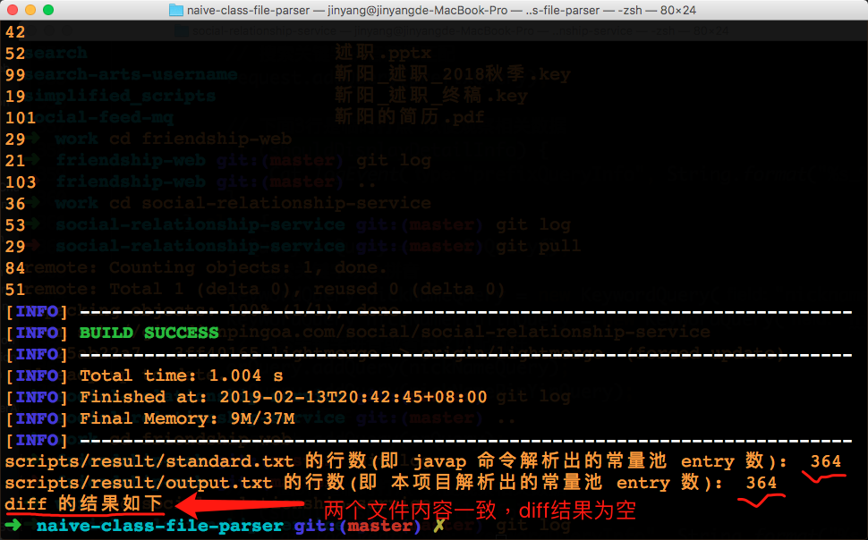

# How to run

The `javap` command can be used to analyze class files.

For example, we can use the following command to analyze `xxx.class`

```
javap -v -p xxx.class
```

The goal of this project is to generate similar output to `javap -v -p` 

## Only compare the analysis result for the constant pool

Please execute the following command in the root directory of this project

```bash
./scripts/constantPool.sh 'com.study.parser.MainParser.class'   
```
Then you should be able to see the comparison for the analysis result for the constant pool

The result should look like this


成功执行上述命令后, 
1. 在 [output.txt](scripts/result/output.txt) 中可以看到本项目对常量池的解析结果
2. 在 [standard.txt](scripts/result/standard.txt) 中可以看到 `javap` 命令对常量池的解析结果

# class 文件格式
根据 [4.1. The ClassFile Structure](https://docs.oracle.com/javase/specs/jvms/se7/html/jvms-4.html#jvms-4.1) 的描述, 
class 文件的格式如下

```
ClassFile {
    u4             magic;
    u2             minor_version;
    u2             major_version;
    u2             constant_pool_count;
    cp_info        constant_pool[constant_pool_count-1];
    u2             access_flags;
    u2             this_class;
    u2             super_class;
    u2             interfaces_count;
    u2             interfaces[interfaces_count];
    u2             fields_count;
    field_info     fields[fields_count];
    u2             methods_count;
    method_info    methods[methods_count];
    u2             attributes_count;
    attribute_info attributes[attributes_count];
}
```
本项目中用 [ParseResult.java](src/main/java/com/study/parser/ParseResult.java) 来表示一个 class 文件的解析结果

## 常量池
[4.4. The Constant Pool](https://docs.oracle.com/javase/specs/jvms/se7/html/jvms-4.html#jvms-4.4) 中指明了常量池中支持的所有元素类型.
其中的每个类型都可以对应本项目里 [AbstractConstant.java](src/main/java/com/study/type/constant/AbstractConstant.java) 的一个子类
下面是具体的对应关系

| Constant Type | Value | 对应的类 |
| -- | -- | -- |
| CONSTANT_Class | 7 | [ConstantClass.java](src/main/java/com/study/type/constant/ConstantClass.java) |
| CONSTANT_Fieldref | 9 |  [ConstantFieldref.java](src/main/java/com/study/type/constant/ConstantFieldref.java) |
| CONSTANT_Methodref| 10 | [ConstantMethodref.java](src/main/java/com/study/type/constant/ConstantMethodref.java) |
| CONSTANT_InterfaceMethodref | 11 | [ConstantInterfaceMethodref.java](src/main/java/com/study/type/constant/ConstantInterfaceMethodref.java) |
| CONSTANT_String | 8 | [ConstantString.java](src/main/java/com/study/type/constant/ConstantString.java) |
| CONSTANT_Integer | 3 | [ConstantInteger.java](src/main/java/com/study/type/constant/ConstantInteger.java) |
| CONSTANT_Float | 4 | [ConstantFloat.java](src/main/java/com/study/type/constant/ConstantFloat.java) |
| CONSTANT_Long | 5 | [ConstantLong.java](src/main/java/com/study/type/constant/ConstantLong.java) |
| CONSTANT_Double | 6 | [ConstantDouble.java](src/main/java/com/study/type/constant/ConstantDouble.java) |
| CONSTANT_NameAndType | 12 | [ConstantNameAndType.java](src/main/java/com/study/type/constant/ConstantNameAndType.java) |
| CONSTANT_Utf8 | 1 | [ConstantUtf8.java](src/main/java/com/study/type/constant/ConstantUtf8.java) |
| CONSTANT_MethodHandle | 15 | todo |
| CONSTANT_MethodType | 16 | todo |
| CONSTANT_InvokeDynamic | 18 | todo |


# 其他
1. [Chapter 4. The class File Format](https://docs.oracle.com/javase/specs/jvms/se7/html/jvms-4.html) 中详细描述了 class 文件的格式, 本项目中的代码从中收益良多.
2. 如何通过 `mvn` 命令来运行 `main` 函数可以参考 [(stackoverflow) Maven Run Project](https://stackoverflow.com/questions/1089285/maven-run-project)